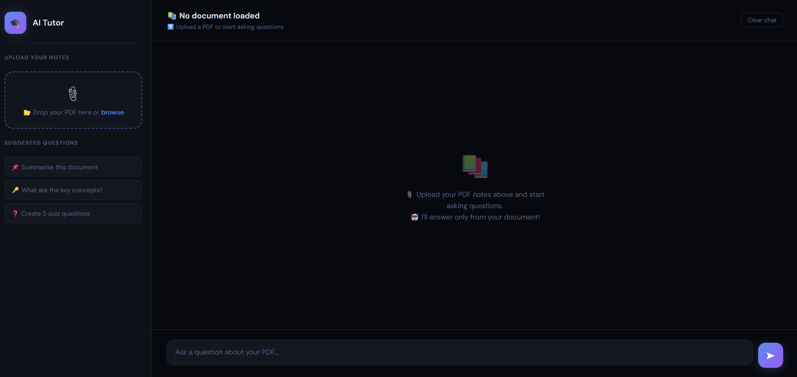

# 🤖 AI Tutor

<p align="center">
  
  
  
  
  
</p>

An AI-powered tutoring application built with **Flask**, **Groq API**, and **Google Generative AI**. The application helps students learn by providing intelligent answers, explanations, code generation, and PDF-based question answering through an easy-to-use web interface.

---

# 📖 Overview

AI Tutor is an intelligent learning assistant that allows users to:

- 💬 Ask academic and programming questions
- 🤖 Receive AI-generated explanations
- 📄 Upload PDF documents and ask questions about them
- 💻 Generate code examples
- 📚 Learn concepts step by step

The project integrates modern AI models into a Flask web application with a clean and simple architecture.

---

# ✨ Features

- 🤖 AI-powered tutoring assistant
- 💬 Interactive chat interface
- 📄 PDF upload and question answering
- 🧠 Detailed concept explanations
- 💻 Programming and coding assistance
- ⚡ Fast AI responses using Groq
- 🌐 Google Generative AI integration
- 🎨 Simple and responsive user interface

---

# 🛠 Tech Stack

### Frontend
- HTML
- CSS
- JavaScript
- Jinja2 Templates

### Backend
- Python
- Flask

### AI Technologies
- Groq API
- Google Generative AI (Gemini)

### Libraries
- Requests
- python-dotenv
- PyPDF2 (or your installed PDF library)

---

# 📂 Project Structure

```text
AI-TUTOR/
│
├── __pycache__/
├── .venv/
├── screenshots/
│   └── ai-tutor.png
│
├── templates/
│   └── index.html
│
├── uploads/
│
├── venv/
│
├── .env
├── .gitignore
├── ai_engine.py
├── app.py
├── data_structures.py
├── LICENSE
├── pdf_reader.py
├── requirements.txt
└── README.md
```

---

# 🚀 Installation

## Clone the repository

```bash
git clone https://github.com/TChandana26/AI-Tutor.git

cd AI-Tutor
```

---

## Create Virtual Environment

### Windows

```powershell
python -m venv venv

.\venv\Scripts\activate
```

---

## Install Dependencies

```bash
pip install -r requirements.txt
```

---

## Configure Environment Variables

Create a `.env` file and add your API keys.

```env
GROQ_API_KEY=your_groq_api_key

GOOGLE_API_KEY=your_google_api_key

SECRET_KEY=your_secret_key
```

---

## Run the Application

```bash
python app.py
```

or

```bash
flask run
```

Open your browser and visit:

```
http://127.0.0.1:5000/
```

---

# 💡 Example Questions

Try asking:

- Explain Binary Search.
- What is Dynamic Programming?
- Write a Python program for Merge Sort.
- Explain Recursion with an example.
- Summarize the uploaded PDF.
- What is the difference between SQL and NoSQL?

---

# 📸 Application Screenshot

## AI Tutor Interface



---

# 📁 Important Files

| File | Description |
|------|-------------|
| `app.py` | Main Flask application |
| `ai_engine.py` | Handles AI model interactions |
| `pdf_reader.py` | Reads and processes uploaded PDF files |
| `data_structures.py` | Data handling and helper functions |
| `templates/index.html` | User interface |
| `uploads/` | Stores uploaded PDF files |
| `requirements.txt` | Project dependencies |

---

# 🔮 Future Improvements

- User Authentication
- Chat History
- Voice-based Interaction
- Dark Mode
- Multiple AI Model Support
- Quiz Generation
- Study Progress Tracking
- Mobile Responsive UI

---

# 🤝 Contributing

Contributions are welcome!

1. Fork this repository.
2. Create a new branch.

```bash
git checkout -b feature-name
```

3. Commit your changes.

```bash
git commit -m "Added new feature"
```

4. Push to GitHub.

```bash
git push origin feature-name
```

5. Open a Pull Request.

---

# 📜 License

This project is licensed under the **MIT License**.

---

# 👩‍💻 Author

**Chandana T**

- GitHub: https://github.com/TChandana26

---

# 🙏 Acknowledgements

- Flask
- Groq
- Google Generative AI
- Python Community

---

⭐ **If you found this project helpful, please consider giving it a Star on GitHub!**
